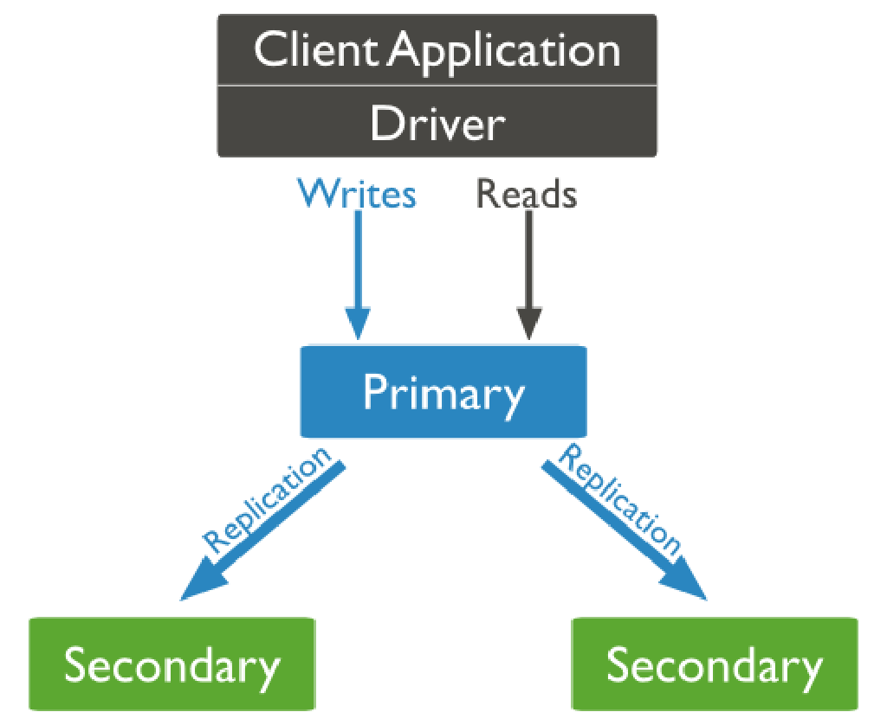
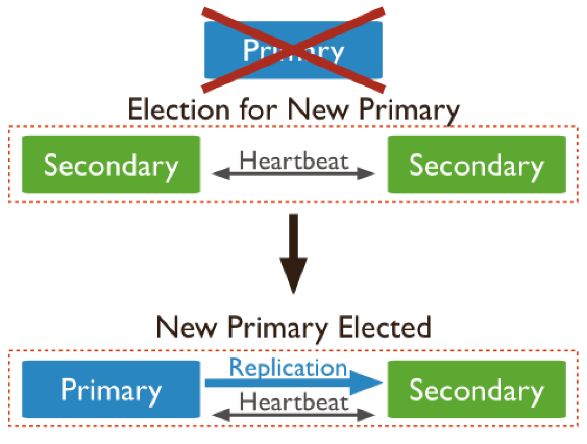

### MongoDB副本集（Replica Sets）


------

mongodb 不推荐主从复制,推荐建立副本集(Replica Set)来保证1个服务挂了,可以有其他服务顶上,程序正常运行,几个服务的数据都是一样的,后台自动同步。主从复制其实就是一个单副本的应用，没有很好的扩展性和容错性。
``
Replica Set 使用的是 n 个 mongod 节点,构建具备自动的容错功能(auto-failover),自动恢复的(auto-recovery)的高可用方案。使用 Replica Set 来实现读写分离。通过在连接时指定或者在主库指定 slaveOk,由Secondary 来分担读的压力,Primary 只承担写操作。对于 Replica Set 中的 secondary 节点默认是不可读的。
``

#### 副本集的结构及原理

副本集包括三种节点:主节点、从节点、仲裁节点：

- **主节点负责处理客户端请求,读、写数据, 记录在其上所有操作的 oplog**;
- **从节点定期轮询主节点获取这些操作,然后对自己的数据副本执行这些操作**,从而保证从节点的数据与主节点一致。默认情况下,从节点不支持外部读取,但可以设置;
  副本集的机制在于主节点出现故障的时候,余下的节点会选举出一个新的主节点,从而保证系统可以正常运行。
- **仲裁节点不复制数据,仅参与投票**。由于它没有访问的压力,比较空闲,因此不容易出故障。由于副本集出现故障的时候,存活的节点必须大于副本集节点总数的一半, 否则无法选举主节点,或者主节点会自动降级为从节点,整个副本集变为只读。因此,增加一个不容易出故障的仲裁节点,可以增加有效选票,降低整个副本集不可用的
  风险。仲裁节点可多于一个。也就是说只参与投票，不接收复制的数据，也不能成为活跃节点。

> 官方推荐MongoDB副本节点最少为3台， 建议副本集成员为奇数，最多12个副本节点,最多7个节点参与选举。限制副本节点的数量,主要是因为一个集群中过多的副本节点,增加了复制的成本,反而拖累了集群 的整体性能。 太多的副本节点参与选举,也会增加选举的时间。而官方建议奇数的节点,是为了避免脑裂 的发生。

``

##### 如何选举主库

MongoDB 的副本集不同于以往的主从模式：自动故障转移
``
**影响选举的因素和条件**
以下因素都会决定一个从库能否成为主库。

- **心跳**：副本集成员每 2 秒发送一次心跳（pings），如果心跳在 10 秒内没有返回，则其它成员将其标记为不可访问。每个节点内部都会维护一个状态映射表，表明当前每个节点是什么角色、日志时间戳等关键信息。如果是主节点，除了维护映射表
  外还需要检查自己能否和集群中内大部分节点通讯，如果不能则把自己降级为secondary只读节点。

- 优先级

  ：其它成员更愿投票给 priority 值高的。

  - Priority 为 0 的不能成为 primary 也不会寻求选举
  - 只要当前主节点具有最高优先级值，或者没有具有较高优先级的辅助节点在该集合中的最新 oplog（操作日志）条目的 10 秒内，副本集就不会保持选举。
  - 如果优先级较高的成员在当前主节点的最新 oplog 条目的 10 秒内赶上，则该集合保持选举，以便为优先级较高的节点提供成为主节点的机会。

- **Optime**：时间戳比较老的不能成为 primary。

- **Connections**：如果大多数副本集不可访问或不可用，则所有剩余成员变为只读。何为大多数？例如 3 个副本集中 2 个为大多数，5 个副本集中有 3 个为大多数。选举需要时间，在选举的过程中，副本集由于没有 primary，不能接受写入，所有剩余成员都变为只读。

``

##### 选举过程



整个选举过程其实非常快，对用户来说几乎是透明的。以下步骤为具体选举步骤。

1. 得到每个服务器节点的最后操作时间戳。每个 mongodb 都有 oplog 机制会记录本机的操作，方便和主服务器进行对比数据是否同步还可以用于错误恢复。
2. 如果集群中大部分服务器 down 机了，保留活着的节点都为 secondary 状态并停止，不选举了。
3. 如果集群中选举出来的主节点或者所有从节点最后一次同步时间看起来很旧了，停止选举等待人来操作。
4. 如果上面都没有问题就选择最后操作时间戳最新（保证数据是最新的）的服务器节点作为主节点。
   ``

##### 选举触发条件

正常情况下不会触发选举，如有以下条件之一则会出触发选举。

1. 初始化一个副本集时。
2. 副本集和主节点断开连接，可能是网络问题。
3. 主节点挂掉。


相对于传统主从模式的优势：

```
传统的主从模式,需要手工指定集群中的 Master。如果 Master 发生故障,一般都是人工介入,指定新的 Master。 
这个过程对于应用一般不是透明的,往往伴随着应用重 新修改配置文件,重启应用服务器等。

而 MongoDB 副本集,集群中的任何节点都可能成为 Master 节点。一旦 Master 节点故障,则会在其余节点中选举出一个新的 Master 节点。 
并引导剩余节点连接到新的 Master 节点。这个过程对于应用是透明的。
```

> 一个副本集即为服务于同一数据集的多个 MongoDB 实例,其中一个为主节点,其余的都为从节点。主节 点上能够完成读写操作,从节点仅能用于读操作。主节点需要记录所有改变数据库状态的操作,这些记录 保存在 oplog 中,这个文件存储在 local 数据库,各个从节点通过此 oplog 来复制数据并应用于本地,保持 本地的数据与主节点的一致。**oplog 具有幂等性,即无论执行几次其结果一致**,这个**比 mysql 的二进制日 志更好用**。